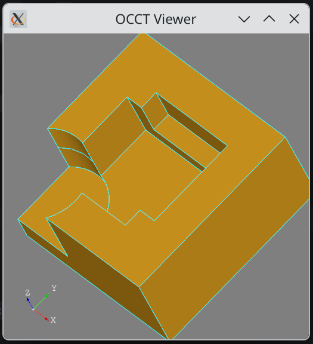
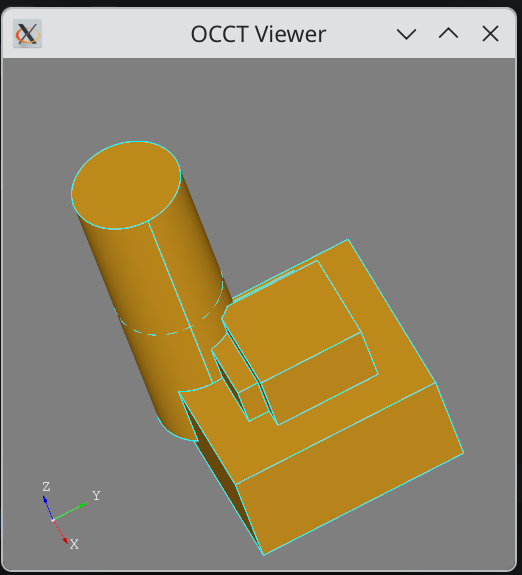

= DSL for CAD Bodies and Assemblies
:icons: font

The purpose of this tool is to share 3D parts and assemblies like java class binaries.

As of today, the DSL is not complete to define bodies and assemblies will come later.

== Building

.Install opencascade binary package (Here on Arch)
[bash]
----
yay -S opencascade
----

Check headers are here, at the expected location:

.Many Headers
[bash]
----
ls /usr/include/opencascade | wc
   7598   53186 1138547
----

.Launch Main App
[groovy]
----
./gradlew cad-dsl:test
----

.Output
image::cad-builder.webp[]

== Sample

Get inspiration from https://github.com/CadQuery/cadquery[CAD Query], but using Groovy DSL.

.Sample Code
[source,groovy]
----
@Test
void "Pillow Block With Counterbored Holes and Prism"() {
    cd().box(length, height, thickness).topZ().wireFrom() {
        double rectSX = length - cboreInset
        double rectSY = height - cboreInset
        [[-rectSX / 2, -rectSY / 2], [0, rectSY],
         [rectSX, 0], [0, -rectSY]].each { double cX, double cY ->
            move(cX, cY)
            circle(centerHoleDia)
        }
    }.toFace().hole(-cboreHoleDiameter).topZ().wireFrom() {
        circle(centerHoleDia)
    }.toFace().prism(cboreHoleDiameter).display()
}

----

WARNING: DSL is evolving

.Renderer
image::https://github.com/Taack/cad-builder/blob/main/screenshot-sketch.webp?raw=true[]

== Packages

There are 3 main packages in `cad-dsl` src folder (both for tests and implementation).

* `org.taack.cad.binding` classes use direct OCCT symbol binding using JExtract. It is considered low-level, and should not be used when composing a new body.
* `org.taack.cad.builder` using the builder pattern, quick way to test builder limitation, this step helps to build a good DSL. This package should not be directly used.
* `org.taack.cad.dsl` using the visitor pattern to build the DSL. This should be used in production.

== DSL Tests

DSL Tests are localised `cad-dsl/src/test/groovy/org/taack/cad/dsl` it could give an overview of `cad-dsl` constructions.

.Cut Version
[source,groovy]
----
@Test
void "Test mix fuse - common - cut"() {
    Vec diagonal = new Vec(1, 1, 1)

    cd().box(2, 2, 1).toCadDsl().cut {
        position(diagonal * 0.4) {
            box(1, 1, 1)
            position(diagonal * 0.3) {
                cylinder(1 / 2, 3)
            }
        }
        position(diagonal * 0.6) {
            box(1, 1, 1)
        }
    }.display()
}
----

.Image Displayed

.Fuse Version
[source,groovy]
----
@Test
void "Test mix fuse - common - fuse"() {
    Vec diagonal = new Vec(1, 1, 1)

    cd().box(2, 2, 1).toCadDsl().fuse {
        position(diagonal * 0.4) {
            box(1, 1, 1)
            position(diagonal * 0.3) {
                cylinder(1 / 2, 3)
            }
        }
        position(diagonal * 0.6) {
            box(1, 1, 1)
        }
    }.display()
}
----

.Fuse Results

== Distribution and Usage

`cad-dsl` has been published on maven for Linux x86 only.

=== Maven

Artifact coordinates:

.Maven
[source,groovy]
----
implementation 'org.taack.cad:cad-dsl:0.1'
----

NOTE: See https://github.com/Taack/cad-dsl-app/blob/main/cad-dsl-linux-app-x86-64/build.gradle[sample-build.gradle] to deal with JMOD files

You can also compile `cad-dsl-native` for your platform, and put the library in your lib path.

=== Sample App using artifact

You can download a sample app https://github.com/Taack/cad-dsl-app/tree/main/cad-dsl-linux-app-x86-64[cad-dsl-linux-app-x86-64]

== Code completion

Your IDE has to support Groovy `@DelegatesTo` must be supported.

The language is statically typed. Intellij IDE Community version should do it.