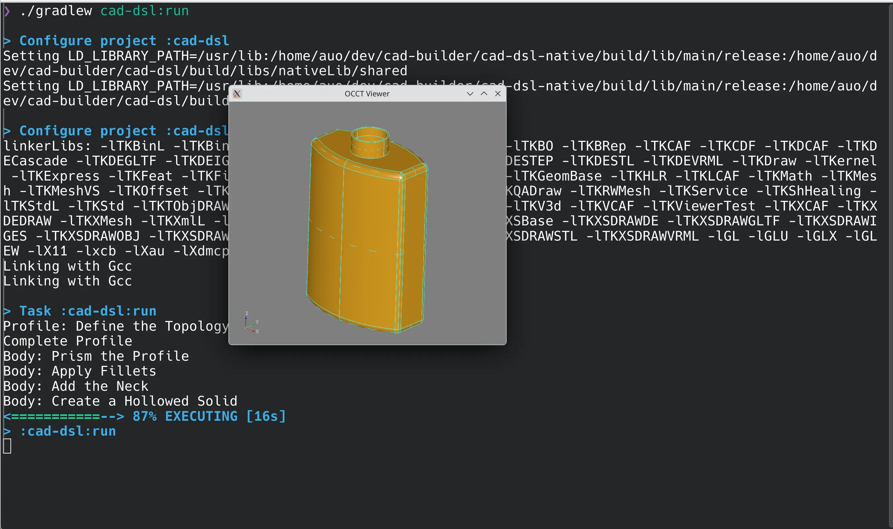

= DSL for CAD Bodies and Assemblies
:icons: font

The purpose of this tool is to share 3D parts and assemblies like java class binaries.

== Building

.Install opencascade binary package (Here on Arch)
[bash]
----
yay -S opencascade
----

Check headers are here, at the expected location:

.Many Headers
[bash]
----
ls /usr/include/opencascade | wc
   7598   53186 1138547
----

.Launch Main App
[groovy]
----
./gradlew cad-dsl:run
----

.Output

== Sample

Get inspiration from CAD Query, but using Groovy DSL.

.Sample Code
[source,groovy]
----
@Test
void "Pillow Block With Counterbored Holes"() {
    cb().box(length, height, thickness).topZ()
        .rect(length - diameter, height - diameter) {
            hole(diameter)
    }.display("test3.png", 640, 480)
}
----

WARNING: ATM `counterboredHole` is implemented as a simple `hole`

.Renderer
image::https://github.com/Taack/cad-builder/blob/main/test3.png?raw=true[]
